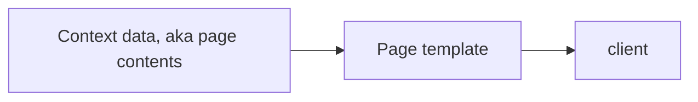

# What is the spectre wiki project?
The spectre wiki project is a software engineering project aiming for next-generation, fast, advanced and modular wiki technology.

> [!WARNING]
> Spectre wiki, and this specsheet is not complete and may change.
## Tech stack
- Main language - Rust
- Database - `Turso`
- Web framework - `Axum`
- logging - `Tracing` - https://crates.io/crates/tracing
- Modules sandboxing - WASMtime - https://github.com/bytecodealliance/wasmtime
- uses GPL 3.0
# Project key goals
1. Create a modern wiki technology
2. Make this technology extremely fast
3. Make it modular via modules
4. Make it safe by default
5. Make it advanced, But dumbed down for casual users.
## Additional goals
- Make spectre wiki into a Wiki-as-a-service provider via a non-profit, only paying for specialty hosting for a small fee.
- Reinvest all money from hosting back into development of the project.
# Feature list
- **(fundamental feature)** rule based Access control - server level
	- fine-grained control (edit, read, conflict resolution perms, ext.)
- **(fundamental feature)** edit difference history, aka diff history
- **(fundamental feature)** conflict resolution
- ([[#Module system]]) High-level modular plugin system
- Full image + audio streaming system
    - optional caching client option (uses temp files)
    - optional quality limiter (for streaming and server sided storage concerns)
    - quality downgrading for low-bandwidth clients
- universal banner system (to be used by plugins and system).
	- Banner system can change the body color, add an icon, change size and add links. 
- Full markdown support using `pulldown-cmark`.
- GitHub repository connection with automatic issue linking. Used for documenting fixes for issues.
- WYSIWYG live rendering markdown editor
- full web client style customization
     - upon setup, ask if they want to pre-install and pre-enable or not.
     - add cool styles like carbon fiber, galaxy, and Y2K, stuff like that
- Google maps object with coordinate and/or address
- standard markdown embed support
- use WASMtime to sandbox WASM plugins for security and control
- (QoL) Easy to setup podman/docker containers
- (QoL) Interactive setup
	- Advanced and simplified system modes (for power users and novices)
- Advanced admin panel
- Full-Text Search (FTS) using turso's FTS5 module
- one-click structured markdown export of the entire wiki.
- 
## Module system
When creating plugins or modules, we need to create a fast and secure system. 

Modules will be compiled in WASM, and run via a WASMtime process. This allows Spectre to control and directly manage its modules without exposure to the host's device or container

This system maintains control over performance, run states with hot-restart capability, and allows potentially malicious code to be completely isolated. 
### Installation
These WASM plugins will be uploaded to the server via spectre's dashboard, or can be pasted into the instance's module's folder, although that may not be recommended.
### Module development
To develop these plugins, we will develop a faux-API program that will allow the developer to manually trigger API messages in a simulated enviroment the same as spectre's WASMtime sandboxing.
### API
Spectre will use a private, internal REST API for module communication. This API is only exposed to the WASMtime instance spectre controls.
### Security
Upon startup, spectre will ping a module for its "module declaration". This decalration will contain the module's name, description, version, required permissions, and other details. 

Spectre will have permissions for each of it's API calls, but for API calls to function, the module is required to announce its permissions. This "permissionless unless required" system will allow the user to see any module's capabilites. 
# Current systems
## Serving pages
In spectre, we use templates to serve pages. These templates are served alongside a context package that is rendered into the HTML. These context packages are insertable bits of data, for example; The page's HTML content fetched from the database.

### Data holding
The page data will be saved in 2 formats; markdown, and HTML. The raw data will be handled by the `pulldown-cmark` parser, then rendered into HTML data that is saved in the database. This HTML data is what will be served in the context data when serving pages.

# Development plan 
## Stage 1 - Alpha/prototype 0.1.0-Alpha.XX
- Integrate turso
- establish routers
- establish basic slug editing
- establish page creation and editing
- establish full edit history - major / minor / drafts
- establish server sided role based access control
- create basic UI
## Stage 2 - Beta 0.1.0-Beta.XX
- add image + video storage and streaming
- add basic WYSIWYG markdown editor
# Development notes
## Modules API changes
When we need to make changes to the module API, Add the new API commands and keep the legacy commands UNTIL a major version. Once the major update is ready, we remove all of the legacy API commands.