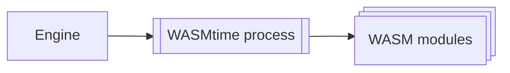

# What is the spectre wiki project?
The spectre wiki project is a software engineering project aiming for next-generation, fast, advanced and modular wiki technology.

> [!WARNING]
> Spectre wiki, and this specsheet is not complete and may change.
## Tech stack
- Main language - Rust
<!-- - UI - Leptos: in SSR mode -->
- Database - `spacetimeDB`, or `Turso`
- Web framework - `Axum`
- logging - `Tracing` - https://crates.io/crates/tracing
- Modules sandboxing - WASMtime - https://github.com/bytecodealliance/wasmtime
# Feature list
- **(fundamental feature)** rule based Access control - server level
	- fine-grained control (edit, read, conflict resolution perms, ext.)
- **(fundamental feature)** edit difference history, aka diff history
- **(fundamental feature)** conflict resolution
- ([[#Plugin/Module system]]) High-level modular plugin system
- Full image + audio streaming system
    - optional caching client option (uses temp files)
    - optional quality limiter (for streaming and server sided storage concerns)
    - quality downgrading for low-bandwidth clients
- universal banner system (to be used by plugins and system).
	- Banner system can change the body color, add an icon, change size and add links. 
- Full markdown support using `pulldown-cmark`.
- GitHub repository connection with automatic issue linking. Used for documenting fixes for issues.
- WYSIWYG live rendering markdown editor
- full web client style customization
     - upon setup, ask if they want to pre-install and pre-enable or not.
     - add cool styles like carbon fiber, galaxy, and Y2K, stuff like that
- Google maps object with coordinate and/or address
- standard markdown embed support
- use WASMtime to sandbox WASM plugins for security and control
- (QoL) Easy to setup podman/docker containers
- (QoL) Interactive setup
	- Advanced and simplified system modes (for power users and novices)
- Advanced admin panel 
### Uncertain features
- Multi-database compatibility
- System-level notifications? (overheating/near storage limits? for raspberry pi or latte panda servers?)
### Vetoed features
- Real time collaborative editing
	- Hard to achieve without lots of complex code.
## Module system
When creating plugins or modules, we need to create a fast and secure system. 

Modules will be compiled in WASM, and run via a WASMtime process. This allows Spectre to control and directly manage its modules without exposure to the host's device or container

This system maintains control over performance, run states with restart capability, and allows potentially malicious code to be completely isolated. 
### API
To prevent idle-running modules, Spectre will use a call-by-call API. 

Spectre will trigger an event, calling a module to run, then allowing the module to return a value or action.
# Development plan 
## Stage 1 - Alpha/prototype x.x.1
- Use basic database like turso (rust-rewrite of sqlite)
- establish basic slug editing
- establish reliable page creation and editing
- establish full edit history - major / minor / drafts
- establish server sided role based access control
- SSR rendering when a page is saved
- basic UI
- add conflict resolution (automatic conditions like newest or most lines, or only allow manual conflict resolution)
- role based access control
## Stage 2 - Beta 1 x.1.x
- integrate spacetimeDB usage
- add image + video storage and streaming
- add basic WYSIWYG markdown editor
# Development notes
## Modules API changes
When we need to make changes to the module API, Add the new API commands and keep the legacy commands UNTIL a major version. Once the major update is ready, we remove all of the legacy API commands.