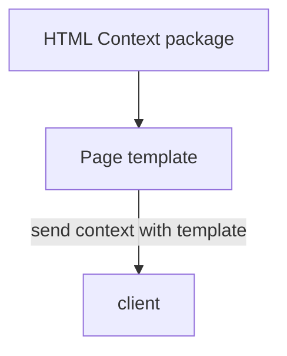
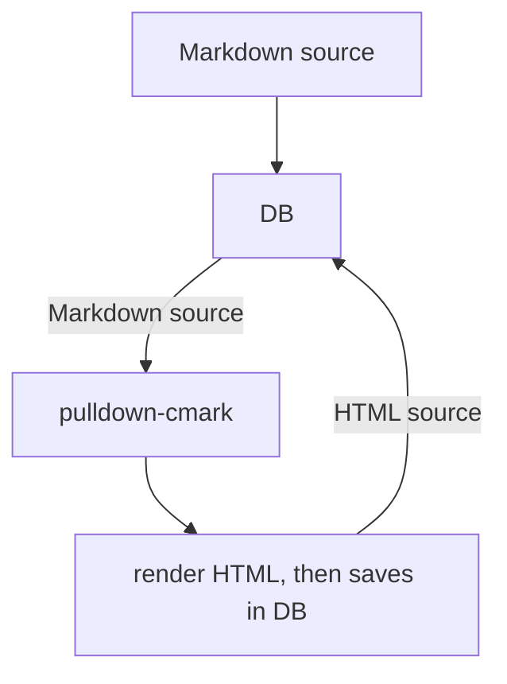
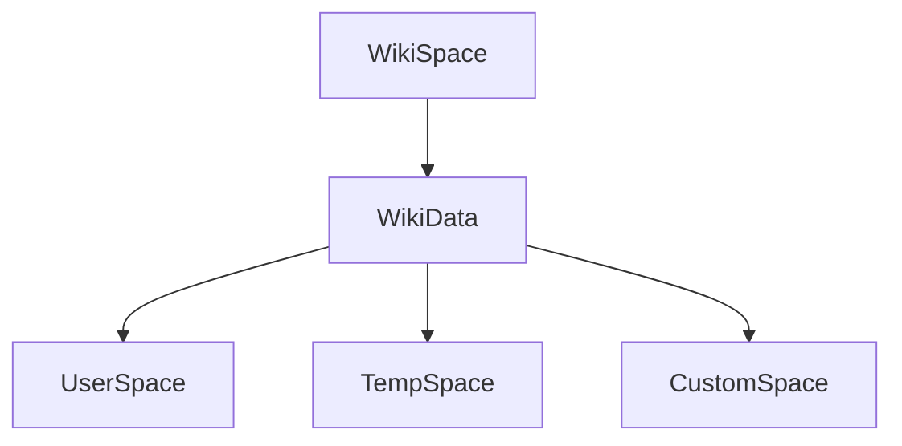
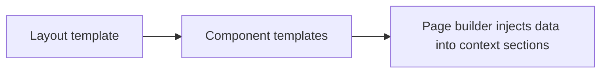

# What is the spectre wiki project?
The spectre wiki project is a software engineering project aiming for next-generation, fast, advanced and modular wiki technology.

> [!WARNING]
> Spectre wiki, and this specsheet is not complete and may change.

## Tech stack
- Main language - Rust
- Database - `Turso`
- Web framework - `Axum`
- logging - `Tracing` - https://crates.io/crates/tracing
- Modules sandboxing - WASMtime - https://github.com/bytecodealliance/wasmtime
- Password hashing - `argon2`
%%- Media handling - `ffmpeg` (subprocess) / `symphonia`, served via `tower-http` range requests%%
- uses **AGPL 3.0**

> [!NOTE]
> **Why AGPLv3 instead of GPLv3:** GPLv3's copyleft obligations trigger on *distribution* of the binary. Since a core project goal is running a nonprofit Wiki-as-a-Service, GPLv3 would let a competing host fork Spectre, modify it, and never share those changes back — they're never "distributing" anything, just running a service. AGPLv3 closes this by requiring source disclosure to users interacting with a modified version over a network. This protects the commons from exactly the kind of competitor most likely to appear, at the cost of some corporate adopters with blanket "no AGPL" policies avoiding self-hosted deployment.

# Project key goals
1. Create a modern wiki technology
2. Make this technology extremely fast
3. Make it modular via modules
4. Make it safe by default
5. Make it advanced, but dumbed down for casual users (UI change)

## Additional goals
- Make spectre wiki into a Wiki-as-a-service provider via a non-profit, only paying for specialty hosting for a small fee.
- Reinvest all money from hosting back into development of the project; Developers and infra.

# Feature list
Note: This is an all-in-one condensed list of all the *possible* features we want to add, not in what order.
- **(fundamental feature)** rule based Access control - server, namespace, and page level
	- fine-grained control (edit, read, conflict resolution perms, etc.)
	- permissions table includes a `scope` column (`server` / `namespace` / `page`) from Stage 1, even if only `server`-scoped rows are written initially — avoids a breaking migration when granular scopes are added later
- **(fundamental feature)** edit difference history, aka diff history
- **(fundamental feature)** conflict resolution
- ([[#Module system]]) High-level modular plugin system
- Image + audio playback support
    - integrates with existing tooling (`ffmpeg`/`symphonia`) rather than building codec/transcoding infrastructure in-house
    - optional caching client option (uses temp files)
    - optional pre-transcoded quality tiers at upload time, selected at serve time based on client hints (not full adaptive bitrate streaming)
    - HTTP range request support for scrubbing, via `tower-http`
- universal banner system (to be used by plugins and system)
	- Banner system can change the body color, add an icon, change size and add links
- Full markdown support using `pulldown-cmark`
- GitHub repository connection with automatic issue linking. Used for documenting fixes for issues.
- WYSIWYG live rendering markdown editor
- full web client style customization
     - upon setup, ask if they want to pre-install and pre-enable or not
     - add cool styles like carbon fiber, galaxy, and Y2K, stuff like that
- standard markdown embed support
- use WASMtime to sandbox WASM plugins for security and control
- (QoL) Easy to setup podman/docker containers
- (QoL) Interactive setup
	- Advanced and simplified system modes (for power users and novices)
- Advanced admin panel
	- also integrate developer mode for contributors
- Full-Text Search (FTS) using turso's FTS5 module
	- Build to a context search engine; Allowing one or the other mode of operation.
- one-click structured markdown export of the entire wiki
- Authentication system — see [[#Authentication]]
- Rate limiting detection and blocking
- botting detection and banning
- system action logging (who changed what setting and when)
- i18n translation
- misc accessibility features (add more)
- Linktree (An interactive, spiderweb of all the linked pages)
- **(fundamental feature)** Backlinks

<!-- ## Conflict resolution
- **Stage 1/2 approach: three-way merge** (MediaWiki-style). Uses the last-common-ancestor revision plus both diverging edits, run through a diff3-style merge algorithm. This fits naturally on top of the diff-history feature already planned — revisions are stored either way, so this is mostly a merge algorithm layered on existing data.
- **Considered for later: CRDTs** (e.g. via `yrs`) for real-time, Google-Docs-style simultaneous editing. This is a much larger commitment: it changes the storage format (CRDT ops/state rather than markdown snapshots), requires the WYSIWYG editor to speak the CRDT protocol, and needs a sync layer. Not required for a functional wiki (Wikipedia itself has no real-time collab) — treated as an optional Stage 3+ mode, not a prerequisite. 
  Fix this here ^-->
## Authentication
- **Local accounts** (username/email + password) as the always-available baseline, hashed with `argon2`. Kept in core rather than delegated to modules, since auth is too security-critical to fully hand to third-party WASM code by default.
- **OIDC/OAuth2 (GitHub, Google, etc.) as pluggable modules**, not baked into core. Each provider is a module that declares its required permissions (session creation, profile read) through the existing module declaration/permission system — consistent with how other modules work.
- **Sessions are server-side**, stored in Turso, rather than self-contained JWTs — allows instant revocation (banned users, compromised accounts) without needing a separate revocation-list system bolted on afterward.
## Module system
When creating plugins or modules, we need to create a fast and secure system.

Modules will be compiled in WASM, and run via a WASMtime process. This allows Spectre to control and directly manage its modules without exposure to the host's device or container.

This system maintains control over performance, run states with hot-restart capability, and allows potentially malicious code to be completely isolated.
### Installation
These WASM plugins will be uploaded to the server via spectre's dashboard, or can be pasted into the instance's module's folder, although that may not be recommended.
### Module watchdog
*note: WIP concept - TODO: add info for actions*
Some modules might have memory leaks if they are written in bad languages, or if their code has a design bug in it that causes it to hang. The module watchdog will automatically hot-reload a module, or disable it if it becomes troublesome. 
### Module development
To allow developers to make these plugins easily, we will need develop a tool that creates an identical WASMtime instance, that will allow the developer to manually trigger API messages.
### API - aka the "Guest-Host module API"
Spectre will use an **internal REST-shaped host API**, not a networked REST API. Host functions are exposed to the WASM guest via WASM's normal import/export ABI (e.g. bound through `wasmtime::Linker`), mimicking REST semantics — verb + resource path + JSON payload/response, passed through shared linear memory — without opening any actual socket inside the sandbox. This gives module developers a familiar request/response mental model while keeping each "endpoint" individually permission-gated as a host function call, with no real network attack surface from within the sandbox.
#### Listing API calls
*Note: This is just a list of all the potential calls we may need, this will not reflect the real thing. And its also very incomplete.*
- Trigger: upon page update
- Trigger: upon user load

- Module Logger:
	- A developer mode screen to view logs, plus serves as the crashdumper.
### Security
Upon startup, spectre will ping a module for its "module declaration." This declaration will contain the module's name, description, version, required permissions, and other details.

Spectre will have permissions for each of its API calls, but for API calls to function, the module is required to announce its permissions. This "permissionless unless required" system will allow the user to see any module's capabilities.
# Current systems
## Serving pages
In spectre, we use templates to serve pages. These templates are served alongside a context package that is rendered into the HTML. These context packages are insertable bits of data, for example; The page's HTML content fetched from the database.

### Rendered data holding
The page data will be saved in 2 formats; markdown, and HTML. The raw data will be handled by the `pulldown-cmark` parser, then rendered into HTML data that is saved in the database. This HTML data is what will be served in the context data when serving pages.

Raw HTML editing is not permitted, and is only allowed to be overritten when the markdown is changed and needs to be re-rendered.
# Future WaaS NPO
## Data handling and compliance
This is **only** relevant specifically to the nonprofit Wiki-as-a-Service hosting offering (not self-hosted instances, where the instance admin is the data controller).

- **Content moderation / CSAM scanning**: required by law in most jurisdictions once third-party image/audio uploads are hosted at scale, regardless of nonprofit status. Plan to integrate automated hash-matching against known-CSAM databases at upload time (e.g. PhotoDNA or Thorn's Safer, both offer free access for qualifying nonprofits/NGOs) as a baseline, plus a publicly documented abuse/DMCA takedown process before launch.
- **Backups & data portability**: the one-click structured markdown export feature doubles as the backup and data-export mechanism rather than building a second system. Plan for automated periodic backups (self-hosted: to the instance admin's own storage; hosted: per documented retention policy).
- **Data deletion**: hosted users need a documented, user-triggerable "export and delete my data" flow to meet GDPR/PIPEDA-type timely-deletion requirements.
- A full Trust & Safety / data policy document is out of scope for this technical specsheet but should exist before the hosting service launches.
# Development plan
This is where we acutally plan everything out - still work in progress and is updated as we go.
## Alpha/prototype 0.1.0-Alpha.1
- Integrate turso
- establish routers
- establish basic slugs
- very basic local accounts
## 0.1.0-Alpha.2
- establish page creation and editing
- establish full edit history - major / minor / drafts
- create basic UI
## Beta 0.1.0-Beta.XX
- add image + video storage and playback (ffmpeg/symphonia integration, range-request serving)
- add basic WYSIWYG markdown editor
- add three-way merge conflict resolution
- establish server sided role based access control (schema includes scope column for future namespace/page-level ACL)
- establish local authentication (argon2 + server-side sessions)
## Stage 3+ / Future
- namespace and page-level ACL scopes activated
- add OIDC/OAuth2 module(s) for third-party login
# Development notes
## Modules API changes
When we need to make changes to the module API, add the new API commands and keep the legacy commands UNTIL a major version. Once the major update is ready, we remove all of the legacy API commands.
## Page structures
*Note: Work in progress - May change*
Below is a full diagram to spectre's page structure system. In spectre, we address pages to different stages of ownership: UserSpace, TempSpace, and CustomSpace. Each of these spaces are virtual areas we use to manage data.

The UserSpace is the default space pages are addressed to, it shows all publicly available pages to users in the wiki. The TempSpace is used for, you guessed it, temp pages (like drafts). The CustomSpace is special: In a custom space, it gives the page's link a new name (e.g, `CustomSpaceName:PageName`, like `betteredit:Getting-started`). This page is distinct from the original page, acting as if it was its own page, but in reality it is still "owned" by the main page, and is only a branch of it virtually.

## Database structure
*Note: incomplete*
In spectre, we use the database for a lot of things. But more importantly it is used to save the pages we write. 

## Component templates and page builders
In spectre, we use the template system (see [[#Serving pages]]). But in order to make more complex pages, we need to use what we call components. 

As an example, a component would be the pages sidebar, or a static rectangle in the page. These components are taken by the page builder and applied to the layout template, that is then served to the client.

we will also integrate dynamic components that are; you guessed it, dynamic objects. For example: adding a weather widget with code to fetch my local weather information. But since this component is applied and sent to the client, the client runs the dynamic workload (albeit WASM or JS).